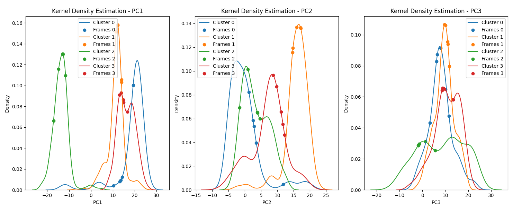

<p align="justify"><b>This tutorial is designed to calculate the energy contribution of amino acid residues to the energy barrier of a given reaction. It achieves this by performing single-point calculations on both the reactant and transition state structures, each with the specified residue deleted. </b></p>

<p align="justify"> It requires a cMD *xtc trajectory file, a *tpr and a *gro file. In the first part, the trajectory is corrected with gmx trjconv and the PCA vectors are calculated for the protein mainchain. Then, the pca_dbscan_gmm.py uses DBSCAN to identify outliers and performs a clustering analysis with the Gaussian mixture models. Through a kernel density-based method, the script is also able to identify the PCA vectors that correspond to the highest density of frames in a cluster, and output the 5 frames that are closest to the identified point. Then, the frames are extracted from the trajectory to separate *.gro files. </p>

---

<br>
<h2> <p align="center"> <b>I - Trajectory correction and extraction of the PCA vectors</b> </p></h2>

<br/>

We start by correcting the cMD trajectory using trjconv (this assumes a truncated octahedron box, change the routine according to your box type):

```js
`# Make a *ndx selection with the region of interest for the analysis.`
`# In this case we can use the mainchain of protein residues within 10 angstrom from the catalytic residues.`
gmx make_ndx -f ref.gro -o act.ndx

`# Correct the PBC of the octahedron box.`
echo 1 0 | gmx trjconv -f trajectory.xtc -s ref.tpr -ur compact -pbc mol -center -o trajectory_pbc.xtc

`# Fit the trajectory relative to the previously created selection.`
echo 27 0 | gmx trjconv -f trajectory_pbc.xtc -s ref.gro -n act.ndx -fit rot+trans -o trajectory_fit.xtc    
```

<br/>

Then we extract the PCA vectors from the corrected trajectory:

```js
`# Covariance analysis to extract the eigenvectors from the cMD trajectory.`
echo 27 27 | gmx covar -f trajectory_fit.xtc -s ref.gro -n act.ndx -ascii -v eigenvec.trr -last 3 

`# Print the resulting PCA vectors to a pdb file.`
echo 27 27 | gmx anaeig -f trajectory_fit.xtc -s ref.gro -n act.ndx -v eigenvec.trr -3d pc.pdb -last 3 
```
<br/>

Clean up the pc.pdb file to include only the PCA vectors:
```js
cat pc.pdb | head -n -2 | tail -n +6 | awk '{print $6,$7,$8}' > temp && mv temp pc.pdb
```

<br/>
<h2> <p align="center"> <b>II - Clustering of PCA vectors and identification of representative frames</b> </p></h2>

<br/>

Now we run the <a href="https://arvpinto.github.io/3D_clustering_PCA/pca_dbscan_gmm.py" target="_blank">pca_dbscan_gmm.py</a> script to obtain the clusters and the representative frames.
The <a href="https://arvpinto.github.io/3D_clustering_PCA/pca_dbscan_gmm.py" target="_blank">pca_dbscan_gmm.py</a> script has the following usage:

```js
python pca_dbscan_gmm.py <data_file> <eps> <min_samples> <n_components>
```
<p align="justify">The &lt;data_file&gt; should be the processed pc.pdb file, &lt;eps&gt; and &lt;min_samples&gt; define the parameters for outlier identification using the DBSCAN method, and &lt;n_components&gt; defines the number of clusters in the Gaussian Mixture Models clustering. The script produces a 3D plot of the PCA vectors, where the outliers are represented as black markers, the frames closest to the highest density points as white markers, and each cluster displays a different color. Additionally, the density distribution curves of each cluster are plotted against each PCA vector, with markers representing the identified frames.
Initially try different &lt;eps&gt; and &lt;min_samples&gt; values to see which and how many frames are being identified as outliers.
Once you have an adequate number of outliers, try different &lt;n_components&gt; values to identify which number of clusters is more suitable.
Also take a look at the kernel density plots to see if the density distributions have a regular shape, and the identified frames lie close to highest density points. </p>
<br/>

```js
Number of DBSCAN outliers: 29
Total number of clusters (GMM): 4
Cluster 0: 595 frames
Top 5 closest frames for Cluster 0: [ 578  721  681  647 1544]
Cluster 1: 1198 frames
Top 5 closest frames for Cluster 1: [1232 1380 1293 1919 1708]
Cluster 2: 463 frames
Top 5 closest frames for Cluster 2: [114  69  68  64  67]
Cluster 3: 215 frames
Top 5 closest frames for Cluster 3: [2015 2076 2050 2052 2054]
```

<br>

<div style="display: flex; justify-content: center; align-items: center; height: 100vh;">
    <iframe src="https://arvpinto.github.io/3D_clustering_PCA/3d_plot.html" width="1904" height="894"></iframe>
</div>
<br>
<div align="center">
    
</div>
<br/>

A clusters.csv file is outputed with the cluster numbers that each frame corresponds to (outliers belong in the -1 cluster).
A frames.dat is ouputed with the top 5 frames that are closest to the highest density point of each cluster.

<br>
<h2> <p align="center"> <b>III - Frame extraction</b> </p></h2>

<br/>

Use the <a href="https://arvpinto.github.io/3D_clustering_PCA/extract_highdens.py" target="_blank">extract_highdens.py</a> script to extract the identified frames from the trajectory.
The <a href="https://arvpinto.github.io/3D_clustering_PCA/extract_highdens.py" target="_blank">extract_highdens.py</a> script usage follows:

```js
python extract_highdens.py <xtc_file> <gro_file> <cluster_indices_file> <output_prefix>
```


