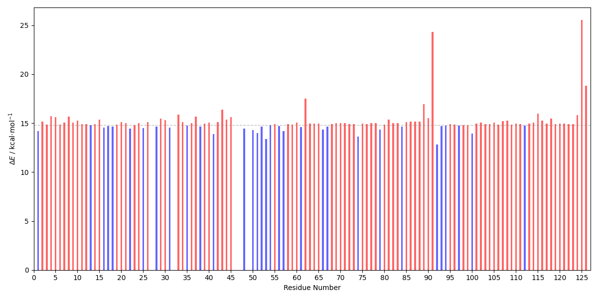
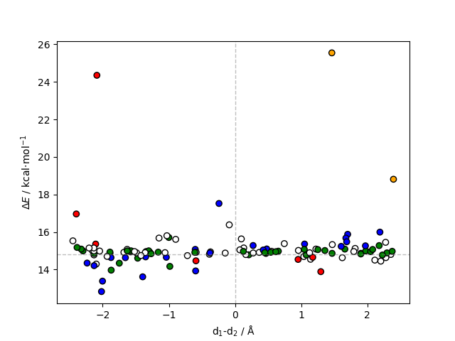

<b>This tutorial is designed to calculate the energy contribution of amino acid residues to the energy barrier of a given reaction. This can be achieved by performing single-point calculations on the provided reactant and transition state structures, each with the specified residue deleted. </b>

 It requires a file with a list of residues to be deleted, a *prmtop file, reactant and transition state structures in the *pdb format, a CP2K input template and a file with a VMD selection of the QM region. The following packages are also required: VMD, cpptraj, parmed. 

---

 
<h2> 
 <b>I - Input Preparation </b> 
</h2>

 

A selection in the format presented in qm_selection.dat is required to adequately build the QM system (the atom numbers change upon residue deletion, therefore they cannot be used). The selection can be prepared by first opening the system in VMD:

<pre style="color: white; background-color: black;">
user@machine:~$ vmd topology.prmtop R.pdb
</pre>

Saving a *.gro file of the system:
<pre style="color: white; background-color: black;">
animate write gro system.gro
</pre>

Making a selection in VMD and saving a *.dat file with the serial numbers of the selection:
<pre style="color: white; background-color: black;">
set sel [atomselect 0 "resid 89 100 232"]
set output [open "serial_numbers.dat" "w"]
puts $output $serial_numbers
close $output
quit
user@machine:~$ sed -i 's/ /+/g' serial_numbers.dat # replace spaces by + for a PYMOL compatible selection
</pre>

The *.gro file can then be opened in PYMOL, the selection introduced and a HL.mol2 file exported:
<pre style="color: white; background-color: black;">
user@machine:~$ pymol system.gro
select my_selection, index 213+123+142+531+515+535+515+5321+523
save HL.mol2, my_selection
</pre>

Then the mol2_vmd-qmsel.sh script can be used to extract the selection in the required format:
<pre style="color: white; background-color: black;">
user@machine:~$ ./mol2_vmd-qmsel.sh HL.mol2 > qm_selection.dat
</pre>

 

The <a href="https://arvpinto.github.io/enzyme_ts_macrodipole_cp2k/res_qmmm_cp2k.sh" target="_blank">res_qmmm_cp2k.sh</a> script has the following usage:

<pre style="color: white; background-color: black;">
user@machine:~$ ./res_qmmm_cp2k.sh residue_list.dat topology.prmtop R.pdb TS.pdb cp2k_template.inp qm_selection.dat
</pre>
 

 It prepares a directory for each residue in the list where the input files for CP2K will be output. The supplied topology and structures will be processed through cpptraj to delete each of the specified residues. Avoid deleting residues from the QM/MM boundary and QM layer. Since deleting residues changes the atom numbering, the QM/MM settings must be updated for each deletion. The <a href="https://arvpinto.github.io/enzyme_ts_macrodipole_cp2k/vmd_cp2k-qmmm.tcl" target="_blank">vmd_cp2k-qmmm.tcl</a> script is called within the latter to produce a file with the configuration of the QM layer, defined by the selection in the qm_selection.dat file. It also prepares a parmed input file that corrects the charges in the *prmtop file for the electrostatic embedding scheme. The cp2k_template.inp file should have tags (PRMTOP_TAG and STATE_TAG) that are replaced with the corresponding filenames. 

 

<h2> 
 <b>II - Output Processing</b> 
</h2>

 

After running the single-point calculations, the following command allows us to extract the absolute energies and calculate the R->TS energy barrier for each residue deletion:

<pre style="color: white; background-color: black;">
user@machine:~$ paste <(for i in RES_*; do echo "$i" | sed 's/RES_//g'; done) <(for i in RES_*; do echo $(grep "Total FORCE" "$i"/res_qmmm_TS.out | tail -n -1) ; done | awk '{print $9}') <(for i in RES_*; do echo $(grep "Total FORCE" "$i"/res_qmmm_R.out | tail -n -1) ; done | awk '{print $9}') | awk '{print $1,($2-$3)*627.509}' | sort -n -k1,1 > energy_differences.dat
</pre>

 

The energy barriers can be plotted with the <a href="https://arvpinto.github.io/enzyme_ts_macrodipole_cp2k/E_diff_bar_plot.py" target="_blank">E_diff_bar_plot.py</a> script:

<pre style="color: white; background-color: black;">
user@machine:~$ python E_diff_bar_plot.py energy_differences.dat
</pre>

 

    

 

 The calculated energy barriers upon deletion can be compared with the original energy barrier (14.8 kcal⋅mol-1) to see if the residues are stabilizing or destabilizing to the transition state of the reaction step. Here, we can see that the deletion of most residues is unfavorable (this is expected for a small protein in a system with a considerable amount of charged molecules), however, the deletion of residue 92 decreases the energy barrier. 

 

For reactions involving charge separation, it might be useful to represent the residues relative to the separation plane that characterizes the macrodipole induced by the enzyme. This can be done with the <a href="https://arvpinto.github.io/enzyme_ts_macrodipole_cp2k/E_diff_dists_plot.py" target="_blank">E_diff_dists_plot.py</a> script:

<pre style="color: white; background-color: black;">
user@machine:~$ python E_diff_dist_plot.py TS.pdb energy_differences.dat 684 34856 1981 1982
</pre>

 

    

 

 The script plots the calculated energy barriers against d1-d2, where d1 is the distance between the center of geometry of the deleted residue and the midpoint between the atoms that represent the direction of the positive charge, and d2 is the distance between the center of geometry of the deleted residue and the midpoint between the atoms that represent the direction of the negative charge. Suppose the used conformation is considerably stable and the charge separation reaction is simple. In that case, this approach can accurately capture and quantify the electrostatic contribution of residues to the transition state. Usually, negatively charged residues close to the positive moiety stabilize the transition state, while positively charged residues are destabilizing (and vice-versa relative to the negatively charged moiety). Note that the electric field induced by enzymes can be quite complex and the latter assumption might not always be true. For example, if a positively charged residue is close to the positive charge, but stabilizing the negative charges of two chemical groups nearby, the repulsion that arises from the lack of neutralizing positive charge may increase the energy barrier instead. In any case, when discussing this type of result, the environment of the specific residues should be taken into account. 

 

